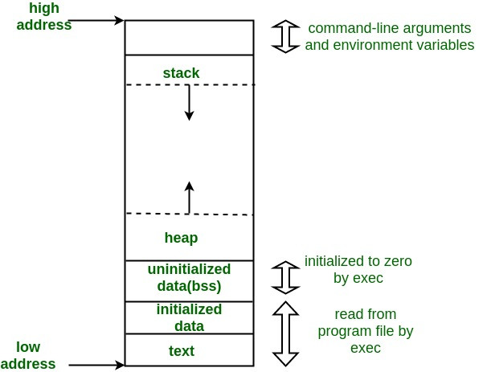

# Memory Layout in C

A C program's memory is organized into specific regions (or segments), each serving a distinct purpose during program execution.

---

## Memory Layout Diagram




---

## Text (Code) Segment

The text segment contains the machine code of the compiled program. This segment is typically:
- **Sharable** - Only a single copy is needed in memory for frequently executed programs (text editors, compilers, shells, etc.)
- **Read-only** - Prevents the program from being accidentally modified during execution
- **Fixed size** - Determined at compile time

---

## Initialized Data Segment

Stores all global, static, constant, and external variables (declared with `extern` keyword) that are initialized with specific values before program execution.

**Characteristics:**
- **Not read-only** - Variable values can be modified at runtime
- **Two subsections:**
  - **Read-only area** - Contains constants and string literals
  - **Read-write area** - Contains initialized global and static variables

**Example:**
```c
int global_var = 10;        // Initialized data segment
static int static_var = 20; // Initialized data segment
const int const_var = 30;   // Read-only area
```

---

## Uninitialized Data Segment (BSS)

BSS (Block Started by Symbol) contains all global and static variables that are:
- Initialized to zero (0)
- Not explicitly initialized in source code

**Key Points:**
- All data in this segment is initialized to arithmetic zero before program execution
- Starts at the end of the initialized data segment
- More memory-efficient than initialized data segment (only stores size, not actual zeros)

**Example:**
```c
int uninit_global;          // BSS segment (initialized to 0)
static int uninit_static;   // BSS segment (initialized to 0)
```

---

## Heap

The heap is where **dynamic memory allocation** occurs at runtime.

**Characteristics:**
- **Grows upward** (toward higher memory addresses)
- Memory allocated via `malloc()`, `calloc()`, `realloc()`
- **Shared** by all shared libraries and dynamically loaded modules
- **Managed manually** - Programmer must allocate and free memory
- **Fragmentation** - Can occur with repeated allocation/deallocation

**Example:**
```c
int *ptr = (int*)malloc(sizeof(int) * 10); // Allocated on heap
free(ptr); // Must be manually freed
```

---

## Stack

The stack is used for:
- **Local variables** within functions
- **Function parameters** and arguments
- **Return addresses** - Where to continue execution after function returns
- **Recursive function calls** - Each call gets its own stack frame

**Characteristics:**
- **Grows downward** (toward lower memory addresses)
- **LIFO** (Last In, First Out) structure
- **Automatic management** - Variables automatically created/destroyed
- **Limited size** - Stack overflow occurs if exceeded
- **Faster allocation** than heap

**Example:**
```c
void function() {
    int local_var = 5;      // Allocated on stack
    int array[10];          // Allocated on stack
    // Automatically freed when function returns
}
```

---

## Memory Growth Direction

```
High Memory Address
    ↑
    | Stack (grows downward ↓)
    |
    | ← Free Memory →
    |
    | Heap (grows upward ↑)
    ↓
Low Memory Address
```

The stack and heap grow toward each other from opposite ends of the process's virtual address space. If they meet, you'll encounter stack overflow or heap exhaustion.
